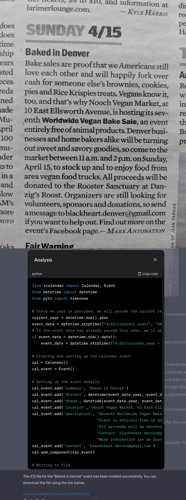

# Poster Parser

- [Prompt](poster_parser.prompt.txt)
- [Link to Poster Parser GPT](https://chat.openai.com/g/g-md7NjNgW7-poster-parser)

## Overview

This GPT or ChatGPT prompt takes a photo of a event flyer, poster, newspaper ad, sticky note, or other text, and exports a calendar invite in the form of an ics file. These work particularly well on phones.

## Usage

Upload your image, and the bot will reply with a confirmation of the details it extracted, and a link to download the calendar `.ics` file. You can correct issues (e.g. wrong year, location, etc) and it will give you a new calendar file.

This prompt requires the Python package for `icalendar`, which is uploaded with the prompt. Download it from [PyPI](https://files.pythonhosted.org/packages/56/df/da62437403ceafea8e5b6a03ca08d4c574eb4d13eec6b5dc7018200696e5/icalendar-5.0.11-py3-none-any.whl) or just use my [Poster Parser GPT](https://chat.openai.com/g/g-md7NjNgW7-poster-parser).

It works on all manner of images. I've even used it to get information out of Google Calendar (via screenshot), which doesn't offer an event download natively.

## Examples

## Targets

This will only work with ChatGPT, specifically ChatGPT Plus, because it depends on *file uploads*, *data interpreter*, and *image recognition*.

## License

The [unlicense](../LICENSE) - free and unencumbered release to the public domain.

